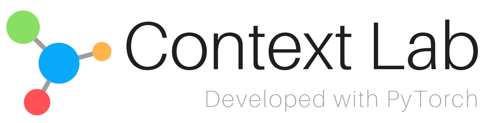

# ContextLab
ContextLab: A Toolbox for Context Feature Augmentation  developed with PyTorch

## Introduction
<!--  -->

The master branch works with **PyTorch 1.1** or higher

ContextLab is an open source context feature augmentation toolbox based on PyTorch. It is a part of the Open-PLUS project developed by [ShanghaiTech PLUS Lab](http://plus.sist.shanghaitech.edu.cn)

## Major Features
- **Modular Design**

- **Multiple Frameworks**

- **High Efficiency**

- **State-of-the-art Performance**

We have implemented several semantic segmentation algorithms in PyTorch with comparable performance
Code will be updated in Oct.

## License
This project is released under the [MIT License](LICENSE)

## Updates

v0.1.0 (26/07/2019)
- Start the project

## Benchmark and Model Zoo
Supported methods and backbones are shown in the below table
Results and models are available in the [Model Zoo](MODEL_ZOO.md)

|                    | Spatial   | ResNeXt  | DenseNet | HRNet |
|--------------------|:--------:|:--------:|:--------:|:-----:|
| Non-local Network  | ✓        | ✓        | ☐        |  ✓     |
| LatentGNN          | ✓        | ✓        | ☐        |  ✓     |
| Dual-attention     | ✓        | ✓        | ☐        |  ✓     |
| GCNet              | ✓        | ✓        | ☐        |  ✓     |
| CCNet              | ✓        | ✓        | ☐        |  ✓     |
| AANet              | ✓        | ✓        | ☐        |  ✓     |
| GloRe              | ✗        | ✗        | ✗        |  ✗     |
| Beyond Grid        | ✓        | ✓        | ☐        |  ✓     |

## Installation

Please refer to [Install.md](INSTALL.md) for installation and dataset preparation.

## Get Started
Please see [GETTING_STARTED.md](GETTING_STARTED.md) for the basic usage of **ContextLab**.

## Contributing

We appreciate all contributions to improve MMDetection. Please refer to [CONTRIBUTING.md](CONTRIBUTING.md) for the contributing guideline.

## Acknowledgement
ContextLab is an open source project that is contributed by researchers and engineers from various colledges and companies. We appreciate all the contributors who implement their methods or add new features.

We wish that the toolbox and benchmark could serve the growing research community by providing a flexible toolkit to reimplement existing methods and develop their own new segmentation methods.

## Citation

## Contact

## Misc.